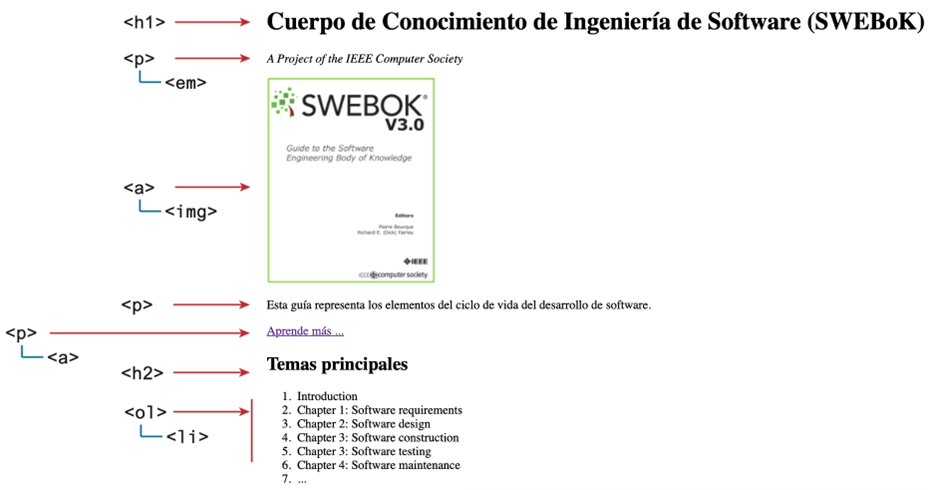
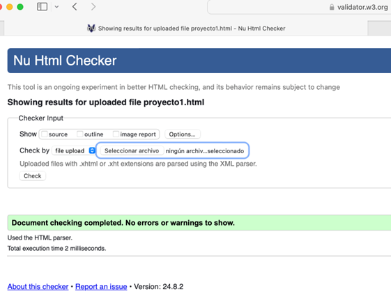

# Práctica 1. Página web - HTML

Este proyecto requiere la creación de una página web sencilla. El resultado final debería ser similar al que se muestra en la Figura 1. 

## Instrucciones 
1.	Crea un nuevo archivo llamado proyecto1.html en el editor de tu elección. 
2.	Comience creando la estructura básica HTML básica 
3.	En el cuerpo, agregue las etiquetas y el contenido como se muestra en la Figura 1 . La imagen es llamada <portada-small.jpg>, envuélvala en un elemento cuyo href esté configurado para <portada- large.jpg>(de modo que cuando el usuario haga clic en la imagen más pequeña, verá una versión más grande de la imagen). 
4.	Para el enlace "Más información", establezca su <em>href</em> en https://www.computer.org/education

## Directrices y pruebas 
1.	Pruebe su página en un navegador y vea si se parece a la de la Figura 1. 
2.	Compruebe el enlace del libro (imagen portada pequeña)
3.	Valide la página utilizando una herramienta integrada en su editor o pegando el archivo HTML en http://validator.w3.org o https://html5.validator.nu y asegúrese de que muestre un mensaje que indique que no contiene errores (Ver Figura 2. Ejemplo de validación)

 

<em>Figura 1. Proyecto web sencillo</em>

### Resultado de validación:

<em>Figura 2. Ejemplo de validación</em>

