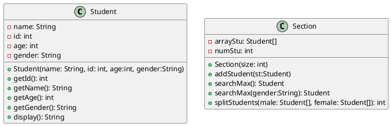

```plantuml
@startuml

class Student {
    - name: String
    - id: int 
    - age: int 
    - gender: String 
    + Student(name: String, id: int, age:int, gender:String)
    + getId(): int
    + getName(): String
    + getAge(): int
    + getGender(): String
    + display(): String
}

class Section {
    - arrayStu: Student[]
    - numStu: int 
    + Section(size: int)
    + addStudent(st:Student)
    + searchMax(): Student
    + searchMax(gender:String): Student
    + splitStudents(male: Student[], female: Student[]): int
}

@enduml
```

